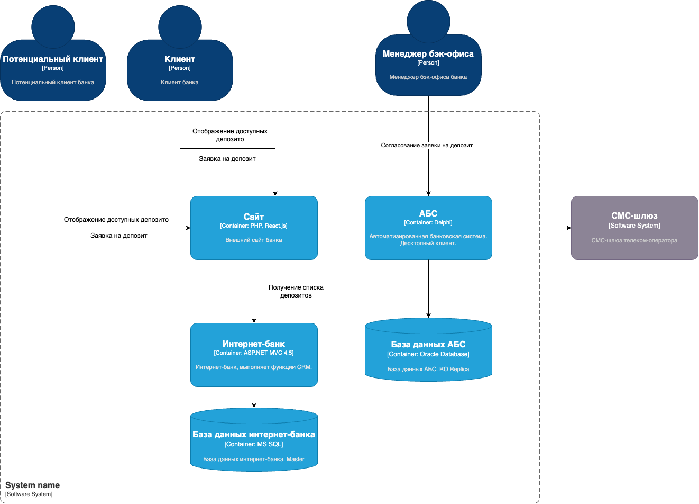

### **Открытие депозитов онлайн:** 
### **Автор: Малашин Я.A.**
### **Дата: 16.05.2025**
### **Функциональные требования**
| **№** | **Действующие лица или системы**                   | **Use Case**                    | **Описание**                                                                                               |
|:-----:|:---------------------------------------------------|:--------------------------------|:-----------------------------------------------------------------------------------------------------------|
|   1   | Потенциальный клиент, Интернет-банк, АБС           | Отображение доступных депозитов | Потенциальный клиент видит список доступных депозитов с актуальными ставками                               |
|   2   | Клиент, Интернет-банк, АБС                         | Отображение доступных депозитов | Клиент видит список доступных депозитов с актуальными ставками и персонализированные ставки лично для него |
|   3   | Потенциальный клиент, Интернет-банк, АБС, СМС-шлюз | Заявка на депозит               | Потенциальный клиент подает заявку на депозит, оставив свой номер телефона и Ф. И. О                       |
|   4   | Клиент, Интернет-банк, АБС, СМС-шлюз               | Заявка на депозит               | Клиент подает заявку на открытие депозита указав счет и сумму депозита                                     |
|   4   | Менеджер бэк-офиса, АБС, СМС-шлюз, клиент          | Согласование заявки на депозит  | Клиент подает заявку на открытие депозита указав счет и сумму депозита                                     |
### **Нефункциональные требования**

| **№** | **Требование**                                                                   |
|:-----:|:---------------------------------------------------------------------------------|
|   1   | Cервисы должны работать 24/7 и быть доступны в 99,9% случаев                     |
|   2   | Отклик по всем операциям должен быть максимально быстрым и занимать миллисекунды |
|   3   | Данные необходимо защищать с помощью механизма шифрования трафика                |
|   4   | Использовать технологии, которые уже есть в банке                                |
### **Решение**

Для начальной версии решения будут использованы текущие технологии и инструменты которые уже есть в банке.
### **Альтернативы**
Переход на микросервисную архитектуру с асинхронными взаимодействиями.

**Недостатки, ограничения, риски**

Избежать прямой работы интернет-банка с API АБС в новом процессе
АБС может масштабироваться только вертикально из-за своей базы данных 

