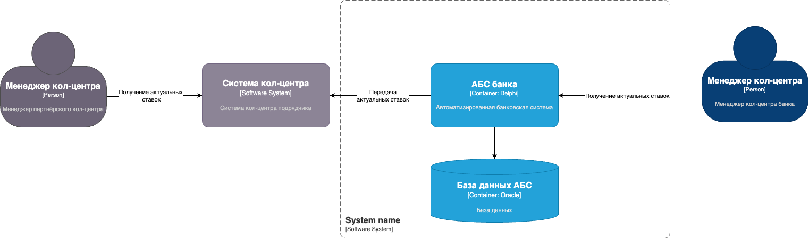

### **Название задачи:** 
### **Автор:**
### **Дата:**
### **Функциональные требования**

| **№** |**Действующие лица или системы**|**Use Case**|**Описание**|
|:-----:| :- | :- | : |
|   1   |Менеджер кол-центра, сайт для бэк-офиса|Возможность для менеджера кол-центра получать список ставок по депозитам||
|   2   |AБС, система кол-центра подрядчика|Возможность передавать актуальные ставки по депозитам в систему кол-центра подрядчика||
### **Нефункциональные требования**
| **№** | **Требование**      |
|:-----:|:--------------------|
|   1   | Защита данных       |
|   2   | Надежность доставки |
|   2   | Доступность данных  |
### **Решение**
Передача файлов через SFTP-протокол

### **Альтернативы**
Асинхронная передача актуальных ставок через брокер сообщений
**Недостатки, ограничения, риски**
- Скорость передачи
- Актуальность данных

